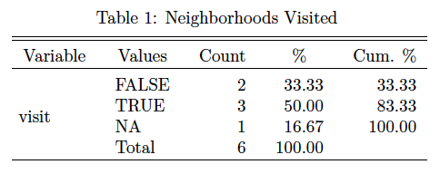

<!-- README.md is generated from README.Rmd. Please edit that file -->
prener 
=======================================================

The goal of `prener` is to document functions that I use frequently in my own research and teaching.

Installation
------------

`prener` is not available from CRAN (and never will be!). You can install `prener` from [Github](https://github.com/chris-prener/prener) with `devtools`:

``` r
# install.packages("devtools")
devtools::install_github("chris-prener/prener")
```

Useage
------

### Plotting

`prener` includes a number of functions that I use in conjunction with `ggplot2`. One issue I address is that `ggsave()` does not accept measurements for `width` and `height` in points, but Keynote lays slides out using points as the unit of measurement. The `cp_points()` function will convert points to inches, centimeters, or millimeters (the units used by `ggsave()`).

``` r
prener::cp_points(200, units = "in")
#> [1] 2.77778
prener::cp_points(200, units = "cm")
#> [1] 7.05556
prener::cp_points(200, units = "mm")
#> [1] 70.5556
```

The [Keynote templates](https://github.com/chris-prener/sequoia_templates) that I use for teaching and presentations have three standard sizes that I create plots for - small (960 x 540 points), medium (960 x 630 points), and large (1024 by 768 points). The `cp_plotSave()` function will export `ggplot2` plots at these dimensions. By default, these are done at 300 dots per inch but that can also be adjusted:

``` r
p <- ggplot(mpg, aes(hwy)) + geom_histogram()

prener::cp_plotSave("hwy.png", p, preset = "sm")
prener::cp_plotSave("hwy.png", p, preset = "med")
prener::cp_plotSave("hwy.png", p, preset = "lg", dpi = 500)
```

### Tables

`prener` has a function, modeled on the [`frequencies` package](https://github.com/DataInsightPartners/frequencies), for creating tidy frequency tables, primarily for discrete variables. The main differences between the original function `freq_vect()` and my implementation is that I (1) make the inclusion of missing data optional and (2) make the number of significant digits displayed explicit and customizeable.

``` r
tableData <- data.frame(
    id = c(1, 2, 3, 4, 5, 6),
    nhoodStr = c("Patch", "Bevo Mill", "Bevo Mill", "Lindenwood Park", "Carondelet" , "Shaw"),
    visit = c(TRUE, FALSE, FALSE, TRUE, TRUE, NA),
    stringsAsFactors = FALSE
    )

prener::cp_tidyTable(tableData$nhoodStr)
#> # A tibble: 6 x 4
#>              data Count Percentage  Cum.
#>             <chr> <chr>      <chr> <chr>
#> 1       Bevo Mill     2       33.3  33.3
#> 2      Carondelet     1       16.7  50.0
#> 3 Lindenwood Park     1       16.7  66.7
#> 4           Patch     1       16.7  83.4
#> 5            Shaw     1       16.7 100.0
#> 6           Total     6      100.0

prener::cp_tidyTable(tableData$visit)
#> # A tibble: 4 x 4
#>    data Count Percentage  Cum.
#>   <chr> <chr>      <chr> <chr>
#> 1 FALSE     2       33.3  33.3
#> 2  TRUE     3       50.0  83.3
#> 3  <NA>     1       16.7 100.0
#> 4 Total     6      100.0

prener::cp_tidyTable(tableData$visit, missRow = FALSE)
#> # A tibble: 3 x 4
#>    data Count Percentage  Cum.
#>   <chr> <chr>      <chr> <chr>
#> 1 FALSE     2       40.0  40.0
#> 2  TRUE     3       60.0 100.0
#> 3 Total     5      100.0
```

The package also provides a function for converting tidy tables into LaTeX-formatted frequency tables. The function can either create a full LaTeX document (`type = "doc"`), only the LaTeX table (`type = "table"`), or only the applicable rows with values (`type = "row"`). The last option can be used for creating a LaTeX table with multiple sections for different discrete variables.

``` r
tableData <- data.frame(
    id = c(1, 2, 3, 4, 5, 6),
    nhoodStr = c("Patch", "Bevo Mill", "Bevo Mill", "Lindenwood Park", "Carondelet" , "Shaw"),
    visit = c(TRUE, FALSE, FALSE, TRUE, TRUE, NA),
    stringsAsFactors = FALSE
    )

prener::cp_texTable(tableData, "visit", type = "table", title = "Neighborhoods Visited")
#> \begin{table}[!htbp] \centering
#> \caption{ Neighborhoods Visited }
#> \label{}
#> \begin{tabular}{@{\extracolsep{5pt}} llrrr} 
#> \\[-1.8ex]\hline 
#> \hline \\[-1.8ex] 
#> \multicolumn{1}{c}{Variable} & \multicolumn{1}{c}{Values} & \multicolumn{1}{c}{Count} & \multicolumn{1}{c}{\%} & \multicolumn{1}{c}{Cum. \%} \\
#> \hline \\[-1.8ex] 
#> \multirow{ 4 }{*}{ visit }  &  FALSE  &  2  &  33.33  &  33.33  \\
#> \hhline{~~~~~}  &  TRUE  &  3  &  50.00  &  83.33  \\
#> \hhline{~~~~~}  &  NA  &  1  &  16.67  &  100.00  \\
#> \hhline{~~~~~}  &  Total  &  6  &  100.00  &    \\
#> \hline \\[-1.8ex] 
#> \end{tabular}
#> \end{table}
```

The output is modeled on the [`stargazer` package](https://cran.r-project.org/web/packages/stargazer/):



### Statistics

`prener` includes a helper function for calculating p-values under the t-distribution:

``` r
prener::cp_probt(3.6308, df = 72)
#> [1] 0.0005254992
```

Contributor Code of Conduct
---------------------------

Please note that this project is released with a [Contributor Code of Conduct](CONDUCT.md). By participating in this project you agree to abide by its terms.
